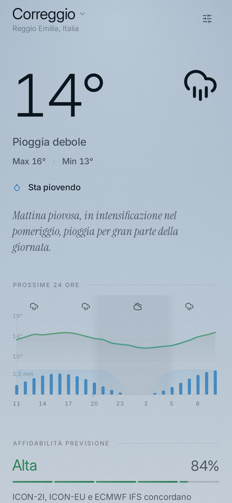
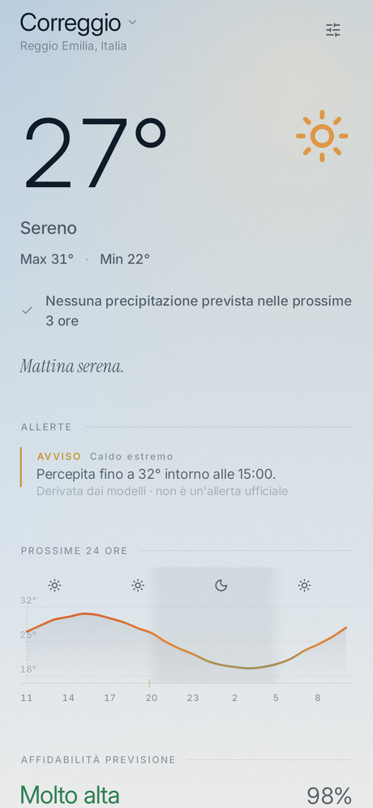
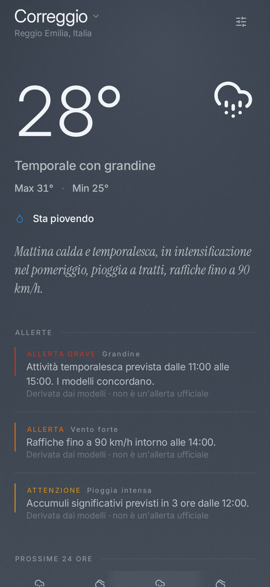
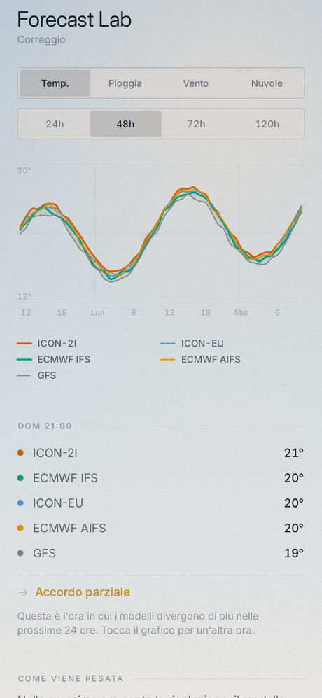
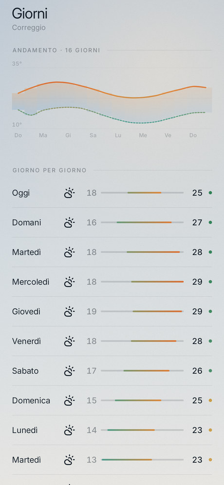
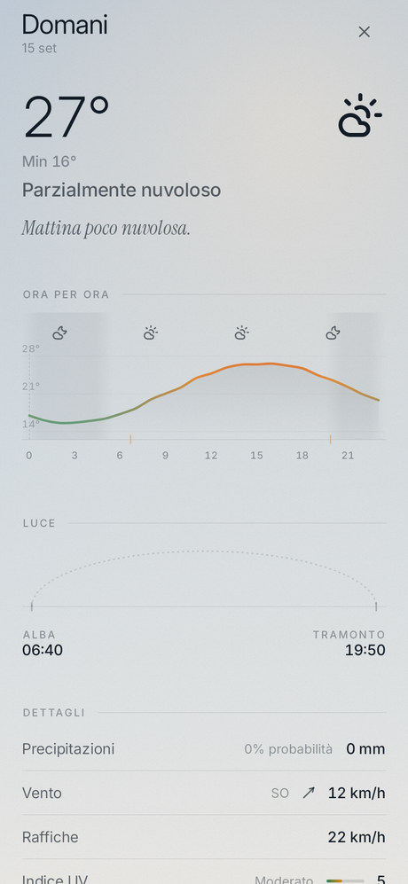

# Sereno

A weather app for Android that is honest about uncertainty.

Most weather apps show you one number and hope you don't ask where it came from.
Sereno runs several of the world's numerical weather models side by side, blends
them according to which one deserves to be trusted at that range, and then tells
you how much the models actually agree — in a sentence, not just a score.

**Simple when you want it. Deep when you need it.**

---

## The APK

A signed, installable release build:

```
app/build/outputs/apk/release/app-release.apk
```

Built with:

```bash
export ANDROID_HOME=/path/to/android-sdk
./gradlew :app:assembleRelease
```

Install it with `adb install -r app/build/outputs/apk/release/app-release.apk`,
or copy it to the phone and open it.

The APK is signed with `keystore/sereno-dev.jks` (store and key password
`serenodev`), which is committed on purpose so that anyone cloning the repo can
produce an installable build. **It is a development key — replace it before
publishing anywhere.**

## Requirements

- JDK 17 or newer
- Android SDK with platform 36 and build-tools 36.0.0
- Gradle 8.13+ (a wrapper is included)
- minSdk 26 (Android 8.0), targetSdk 36

| | | |
|---|---|---|
|  |  |  |
|  |  |  |

---

## Where the forecast comes from

| Provider | Used for |
|---|---|
| **Open-Meteo** | Multi-model forecast gateway, current conditions, 15-minute precipitation, air quality, place search. Licensed CC BY 4.0. |
| **ItaliaMeteo · ARPAE** | ICON-2I, 2.2 km, Italy, to +72 h |
| **Météo-France** | AROME HD, 1.5 km, to +48 h |
| **DWD** | ICON-EU (7 km) and ICON global (11 km) |
| **ECMWF** | IFS and AIFS, 25 km, to +15 days |
| **NOAA** | GFS, kept at low weight as the model to disagree with |
| **Protezione Civile** | National radar mosaic status (see limitations) |
| **Esri Gray Canvas** | Map basemap tiles, no API key |

All seven models arrive in a single Open-Meteo request, which is what makes the
whole premise affordable on mobile data.

### How they are combined

The blend is a lead-time-weighted mean, per field, per hour, skipping nulls. The
weighting encodes one idea — **resolution wins early, physics wins late**:

- a 2.2 km regional model resolves Apennine convection that a 25 km global model
  can only smear, so **ICON-2I dominates the first two days** — then stops
  existing, because it does not run past 72 h;
- **ECMWF IFS climbs** as the regional models drop out and peaks from day 5;
- **AIFS** sits just below its deterministic sibling;
- **GFS** stays at a low flat weight throughout, so that when it is the odd one
  out you can see it.

A model that returns nothing for your location simply never votes — no bounding
boxes required.

### Confidence

The confidence score weighs temperature spread, whether the models agree it
rains *at all* (the heaviest term, because that is the disagreement that ruins
an afternoon), the spread in amounts, wind spread, and how many models answered.
That is then multiplied by a predictability ceiling that falls with lead time,
so unanimity at day 9 still cannot read as certainty. Too few models imposes a
hard cap: one deterministic run can never reach "high".

Every score is accompanied by a generated sentence naming the models and what
they do or do not agree about. It is produced deterministically, offline, from
the numbers — there is no language model involved, by design, because the output
has to be reproducible, auditable and correct in two languages.

---

## What is in the first release

- Current conditions, hourly forecast, and 16 days
- Multi-model blending across ICON-2I, AROME HD, ICON-EU, ICON, ECMWF IFS,
  ECMWF AIFS and GFS
- Confidence scoring with plain-language explanations
- Nowcasting — "rain in 35–50 min", always a range, never a fake single minute
- **Forecast Lab**: every model as its own line over a shared spread envelope,
  a per-hour readout, and the actual weighting curve in force
- Precipitation / cloud / gust map with a 24-hour timeline, over a label-light
  grey basemap with a latitude/longitude graticule
- 14-day trend chart that fades with confidence
- Derived severe-weather warnings (storms, hail, wind, rain, snow, ice, heat,
  cold), clearly labelled as derived rather than official
- GPS, city search, saved places
- Home-screen widget in three sizes
- Rain and severe-weather notifications, deliberately rare
- Light / dark / automatic, Italian and English
- Offline: the last forecast is always shown, with its age
- Developer mode with mock weather states and a diagnostics screen

## Design

The app deliberately does not look like a Material app. It depends on
`compose-foundation` only — there is no `MaterialTheme`, no Material colour
scheme, typography or shapes anywhere in it.

- **No cards.** Structure comes from section labels, hairlines and vertical
  rhythm. Corners are square; the only round things are genuinely circular.
- **No shadows, no ripples.** Depth is layered opacity; a press dips and dims.
- **The backdrop is the product.** One canvas draws the sky in four passes —
  gradient, positioned light source, haze, tiled grain — and shifts with the
  weather and the time of day. Storms and nights stay dark regardless of theme.
- **Typography does the hierarchy.** Inter in two optical sizes (a real display
  cut for the hero temperature, a text cut for everything else), tabular figures
  everywhere numbers line up, and Instrument Serif italic in exactly one place:
  the narrative line.
- **One icon family, everywhere.** Lucide (ISC) — a 24-unit grid at a single
  stroke weight, covering both the weather set and the interface set, so a
  chevron beside a rain glyph genuinely is from the same family. Each asset is
  tinted at the call site, and the widget rasterises the very same drawable the
  app renders.
- **Charts carry their scale.** Value gridlines are labelled inside the plot
  rather than in a gutter, which on a 370dp-wide phone chart is worth more than
  a tidy column of right-aligned numbers. Turn them off in Settings.

Accessibility: content descriptions throughout, 48dp touch targets, honoured
reduce-motion (and battery saver), and charts that distinguish series by dash
pattern as well as by an Okabe–Ito colour.

Privacy: no accounts, no analytics, no advertising, no tracking. Saved places
never leave the device.

---

## Architecture

Single module, deliberately.

```
design/     tokens, atmospheres, typography, motion, primitives, drawn icons
domain/     pure Kotlin: models, synthesis, confidence, nowcast, narrative, severe
data/       providers behind capability interfaces, HTTP, cache, prefs, location
ui/         screens, charts, components
widget/     RemoteViews home-screen widget
work/       background refresh and notifications
```

The domain layer has no Android dependencies, which is why the part most likely
to be quietly wrong is the part that is directly unit-tested.

Providers sit behind `ForecastProvider`, `GeocodingProvider`,
`AirQualityProvider`, `AlertProvider` and `RadarProvider`. Adding Meteoblue or
Meteomatics means implementing an interface; nothing above the repository knows
a vendor's name.

**Sereno never invents a value.** Every field is nullable end to end; a quantity
no model supplied renders as a dash. The one exception is precipitation
probability, which is derived from weighted model agreement when no model
publishes it — and is tagged `Provenance.Derived` so the UI can say so.

### Tests

```bash
./gradlew :app:testDebugUnitTest   # engine + narrative + formatting
./gradlew :app:lintDebug
```

There is also a screenshot suite. No emulator is available in a container
without KVM, so it renders every screen to a PNG on the JVM through
Robolectric's native graphics mode:

```bash
./gradlew :app:testDebugUnitTest --tests "*ScreenshotTest*"
# -> app/build/screenshots/*.png
```

It asserts nothing. It exists so the design can be *looked at*, and it caught
six real defects on its first run.

---

## Limitations

- **Radar imagery is not rendered.** The Protezione Civile API is queried for
  availability and the latest product time, and that is surfaced honestly, but
  its imagery ships as GeoTIFF inside a ZIP and decoding that on-device was not
  something worth shipping half-done. The map therefore shows a **model
  forecast field** — sampled on an 11×11 grid and interpolated — which is
  coarser than radar now but runs 24 hours forward, which radar cannot. It is
  labelled as what it is.
- **No official weather warnings yet.** All warnings are derived from the blend
  and marked as such. `AlertProvider` exists for a real feed.
- **ICON-2I and AROME HD are regional.** Outside their domains they contribute
  nothing, and confidence correctly falls because fewer models answered.
- **The basemap is somebody else's service.** The first release used CARTO's
  public endpoint, which began stamping "API KEY REQUIRED" across every tile;
  against the dark basemap that rendered the map black. It now uses Esri's Gray
  Canvas, the tile source is a one-line swap, and the map states plainly when
  the basemap is unavailable while still drawing the graticule, the marker and
  the forecast field.
- **R8 is off** for this build, so the shipped APK is byte-for-byte what was
  tested. The rules in `proguard-rules.pro` are ready for turning it on.
- **Air quality has no pollen data** and the map layers are limited to
  precipitation, cloud and gusts.
- The APK could not be launched on a device from the build environment; it is
  verified by unit tests, lint, and JVM-rendered screenshots of every screen.

## Next

1. Decode the DPC GeoTIFF product properly and render true radar for Italy,
   with storm-cell tracking and lightning.
2. Official warning feeds (Protezione Civile regional bulletins, MeteoAlarm).
3. Ensemble spread from ECMWF ENS, so confidence rests on a real ensemble rather
   than only on deterministic disagreement.
4. Verification: score each model against observations over time and let the
   weights adapt per location instead of being fixed curves.
5. Turn on R8, add a baseline profile, and measure startup.

---

## Licence and attribution

Weather data by [Open-Meteo](https://open-meteo.com) (CC BY 4.0), from ECMWF,
DWD, NOAA, Météo-France and ItaliaMeteo/ARPAE. Basemap © Esri, © OpenStreetMap
contributors. Radar mosaic © Dipartimento della Protezione Civile. Icons by
[Lucide](https://lucide.dev) (ISC). Inter by Rasmus Andersson and Instrument
Serif by Instrument, both under the SIL Open Font License.
